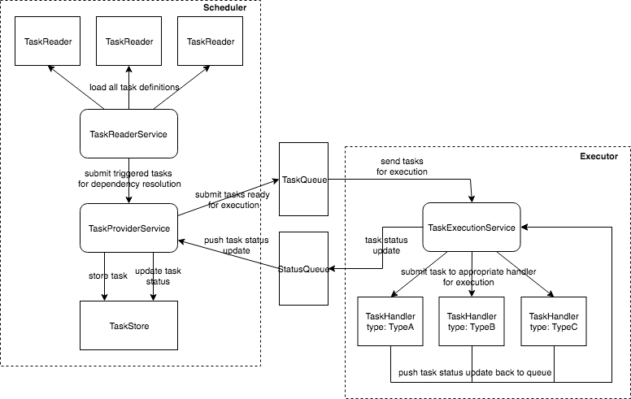

Increasing need for insights from vast data sources have given rise to data driven business intelligence products. These products build and execute complex data workflows.

A data workflow is a set of inter-dependant data driven tasks. Simple solutions use CRON approach which is straightforward and works well for simple workflows that have few or no task dependencies. However, CRON fails miserably if there are complex dependancies between tasks.

At Cognitree, we develop large data workflows for our customers to gather data insights. We built an effective scheduling tool for our data pipelines which is flexible and dynamic to solve the changing business requirements.

# Scheduler Framework

Our Scheduler Framework fits in as a CRON replacement to build, run and monitor complex data pipelines with flexible deployment options. It handles dependency resolution, workflow management, failures. The framework is built on top of [Quartz](http://www.quartz-scheduler.org) and uses DAG (Directed Acyclic Graph) to manage the tasks.

Examples of data pipelines include batch jobs, chaining multiple tasks, machine learning job etc

Scheduler Framework can be compared with [Oozie](http://oozie.apache.org/) and [Azkaban](https://azkaban.github.io/).

The major difference is they are built specifically for Hadoop workflows whereas Scheduler Framework can run anything including big data workflows through its extensible architecture.
Each component of the Scheduler Framework is pluggable allowing the developer to pick from our extensions or write custom extensions.

### Why use Scheduler Framework

* **Dynamic**: Define/ modify workflow and their dependency at runtime.
* **Extensible**: Define custom source of tasks, task handlers and the persistence store.
* **Policy Driven**: Define custom policies to take necessary action on task timeout.
* **Fault Tolerant**: Comes with inbuilt fault tolerance mechanism to handle system/ process faults.
* **Flexible**: Multiple deployment options. Can be embedded into existing code base or deployed as standalone or in distributed mode.

## Architecture

At its core, Scheduler Framework leverages Quartz to enable scheduling of dependent tasks.

At a high level Scheduler Framework consists of three components as depicted in the diagram below.

* **Scheduler**: A key component of the framework responsible for reading all the task definitions from the source, resolving task dependencies and scheduling tasks for execution.
* **Executor**: Responsible for executing the tasks scheduled by scheduler and reporting back the task execution status.
* **Message Bus**: Scheduler and Executor do not communicate directly, instead they use a intermediary buffer (queue) to send messages to each other. The enables users to decouple Scheduler and Executor from each other and run them separately as long as the queue is distributed.




## Getting started with Scheduler Framework

This tutorial will walk you through some of fundamental concepts of Scheduler Framework while building a sample workflow. For those who want to skip the concepts and get started directly by running the sample workflow can move directly [here](#running-the-sample-workflow)

The Sample workflow runs three inter-dependant tasks on a recurring interval.

Scheduler framework read its configuration from `app.yaml`. The following sections define various parts of this configuration file.

#### Defining TaskDefinitions

The source of tasks definition is pluggable and developer can provide a custom source of task which can read from DB, File, URL etc.

In this example we define task definitions in a task-definitions.yaml file in `YAML` format.

```
- name: taskOne
  type: fileLogger
  schedule: 0 0/1 * 1/1 * ? *
- name: taskTwo
  type: consoleLogger
  schedule: 0 0/1 * 1/1 * ? *
- name: taskThree
  type: shellCommand
  schedule: 0 0/5 * 1/1 * ? *
  properties:
    workingDir: /tmp/
    cmd: date
    logDir: /tmp/
  dependsOn:
    - name: taskTwo
      duration: 5m
      mode: all
    - name: taskOne
      duration: 5m
      mode: all
```

Here, `taskOne` is of type `fileLogger` which writes the tasks it receives into a file in tmp directory under a file namely `tasks.txt`, `taskTwo` is of `consoleLogger` which logs the tasks into console and `taskThree` is of type `shellCommand` which executes the shell command defined in task properties. `taskThree` depends on `taskOne` and `taskTwo`.

According to schedule definition above, `taskOne` and `taskTwo` they will run every 1 min and `taskThree` will run every 5 min and is dependent on `taskOne` and `taskTwo`.

While defining dependency, one also has to specify the `mode` and `duration` defining the logical boundary to fetch tasks to satisfy the dependency between them.

For example, In case of `taskThree` `duration` is 5m and mode is `all` for `taskOne` and `taskTwo` which implies the scheduler that `taskThree` depends on the task execution status of all the `taskOne` and `taskTwo` that ran in the last 5 min.

Other possible values of mode are `first`, `last`, `all`. Where `first` means the first instance in the specified duration, `last` means the last instance in the specified duration and `all` means all the instance in the specified duration. Duration can be defined as 5`m/h/s`, where `m` stand for minutes, `h` for hour and `s` for seconds. If none is passed it is assumed to be in milliseconds.

#### Configuring TaskDefinitionReader

Implement [TaskDefinitionReader](scheduler/src/main/java/com/cognitree/tasks/scheduler/readers/TaskDefinitionReader.java) to read the task definitions.

A sample implementation to read tasks definitions from a yaml file is available here as [FileTaskDefinitionReader](examples/src/main/java/com/cognitree/examples/tasks/scheduler/readers/FileTaskDefinitionReader.java)

Configure the `FileTaskDefinitionReader` with the framework as one of the reader under `readerConfig` section

**app.yaml**
```
readerConfig:
  filereader:
    readerClass: com.cognitree.examples.tasks.scheduler.readers.FileTaskDefinitionReader
    config:
      source: /Users/ankitnanglia/workspace/cognitree/scheduler/examples/src/main/resources/task-definitions.yaml
    schedule: 0 0/1 * 1/1 * ? *
```

The framework monitors `task-definitions.yaml` file regularly for changes. In this case, every 1 min configured as the `schedule` for `fileReader`. Any changes made to the tasks defined in `task-definitions.yaml` file will reflect in the next scheduled run of that task.

The task definition reader configuration is complete, next is to configure handler to execute these tasks

#### Configuring TaskHandler

In `task-definitions.yaml` we have defined three types of tasks `fileLogger`, `consoleLogger` and `shellCommand`.

Configure framework to handle these tasks in `app.yaml`.

`app.yaml`
```
handlerConfig:
  fileLogger:
    handlerClass: com.cognitree.examples.tasks.executor.handlers.FileLogger
    maxExecutionTime: 10m
    timeoutPolicy: notifyOnTimeout
    maxParallelTasks: 4
  shellCommand:
    handlerClass: com.cognitree.tasks.executor.handlers.ShellCommandHandler
    maxExecutionTime: 10m
    timeoutPolicy: notifyOnTimeout
    maxParallelTasks: 4
  default:
    handlerClass: com.cognitree.examples.tasks.executor.handlers.ConsoleLogger
    maxExecutionTime: 10m
    maxParallelTasks: 16
```


In the above configuration,

* [FileLogger](examples/src/main/java/com/cognitree/examples/tasks/executor/handlers/FileLogger.java) is configured to handle tasks of `fileLogger`.
* [ShellCommandHandler](extensions/shell-handler/src/main/java/com/cognitree/tasks/executor/handlers/ShellCommandHandler.java) is configured to handle tasks of type `shellCommand`.
* [ConsoleLogger](examples/src/main/java/com/cognitree/examples/tasks/executor/handlers/ConsoleLogger.java) is configured as the `default` handler.

Note: `default` is a special keyword used while defining handlers. Any task type which is not configured explicitly will be handled by handler configured for `default` type

Also for `fileLogger` and `shellCommand` type we have configured timeoutPolicy as `notifyOnTimeout` which is configured under `timeoutPolicyConfig` section of `app.yaml`. Update the missing configuration in `app.yaml` for `notifyOnTimeout` policy such as name, email, password etc.

`app.yaml`
```
timeoutPolicyConfig:
  notifyOnTimeout:
    policyClass: com.cognitree.examples.tasks.scheduler.policies.NotifyOnTimeoutPolicy
    config:
      smtp.host: "smtp.gmail.com"
      smtp.port: 587
      sender.name:
      sender.email:
      sender.password:
      email.subject: "Task Timeout Notification"
      recipient.name:
      recipient.email:
```

Here `notifyOnTimeout` is the id used by the handler while defining timeout policy it should apply in case of timeout. The implementation of NotifyOnTimeoutPolicy can be found [here](examples/src/main/java/com/cognitree/examples/tasks/scheduler/policies/NotifyOnTimeoutPolicy.java).

The task handler configuration is complete, next is to configure Message Bus to be used by scheduler and executor.

#### Configuring Message Bus

As discussed in the architecture section scheduler and executor do not communicate directly, instead they use a intermediary queue to send and receive messages.

Configure in-memory queue which keeps the tasks and task status in memory with the framework in the `app.yaml`.

`app.yaml`
```
taskProducerConfig:
  producerClass: com.cognitree.tasks.queue.producer.InMemoryTaskProducer
taskConsumerConfig:
  consumerClass: com.cognitree.tasks.queue.consumer.InMemoryTaskConsumer
  config:
    pollInterval: 10s # time interval to poll tasks from task queue for execution

taskStatusProducerConfig:
  producerClass: com.cognitree.tasks.queue.producer.InMemoryStatusProducer
taskStatusConsumerConfig:
  consumerClass: com.cognitree.tasks.queue.consumer.InMemoryStatusConsumer
  config:
    pollInterval: 10s # time interval to poll tasks status from status queue
```

#### Configuring task purge interval

Periodically, tasks older than the specified interval and status in one of the final state (SUCCESSFUL/FAILED) are purged from memory to prevent the system from going OOM. The implication of configuring this value is explained in detail [here](scheduler/src/main/java/com/cognitree/tasks/ApplicationConfig.java)

`app.yaml`
```
taskPurgeInterval: 1d
```

Scheduler Framework is now configured with all the required parameters. At the end of this section the `app.yaml` file should look like the one used in the example [here](examples/src/main/resources/app.yaml).

### Running the Sample Workflow

#### Standalone Mode
```
$ clone the repository
$ cd scheduler/examples
$ update readerConfig section in app.yaml to point to the file containing task definition. Sample tasks file is available under examples/src/main/resources/task-definitions.yaml
$ update timeoutPolicyConfig section in app.yaml with the email to use to send notifications in case a task times out
$ mvn clean package
$ java -jar target/examples-1.0-jar-with-dependencies.jar
```

#### Distributed Mode
There is a [app-kafka.yaml](examples/src/main/resources/app-kafka.yaml) file which can be used to deploy scheduler and executor service in a distributed mode by using kafka as a Message Bus.

```
$ clone the repository
$ cd scheduler/examples
$ update readerConfig section in app-kafka.yaml to point to the file containing task definition. Sample tasks file is available under examples/src/main/resources/task-definitions.yaml
$ update timeoutPolicyConfig section in app-kafka.yaml with the email to use to send notifications in case a task times out
$ update bootstrap.servers property in taskProducerConfig/ taskConsumerConfig/ taskStatusProducerConfig/ taskStatusConsumerConfig section in app-kafka.yaml to point to the kafka server
$ mvn clean package
$ start kafka broker
# Start scheduler
$ java -DconfigFile=app-kafka.yaml -Dprofile=scheduler -jar target/examples-1.0-jar-with-dependencies.jar
# Start executor
$ java -DconfigFile=app-kafka.yaml -Dprofile=executor -jar target/examples-1.0-jar-with-dependencies.jar
```

The tasks configured in the `task-definitions.yaml` will be picked by scheduler and scheduled for execution once schedule of task is met and all of its dependent siblings have completed successfully.

